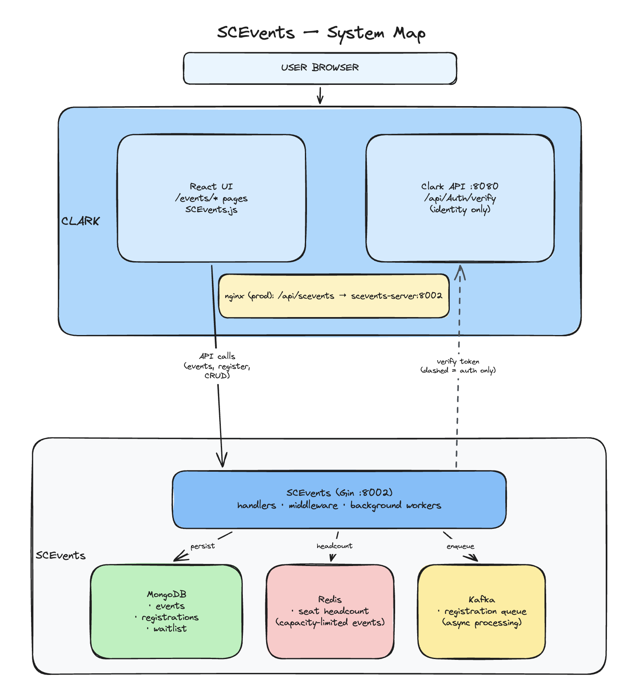
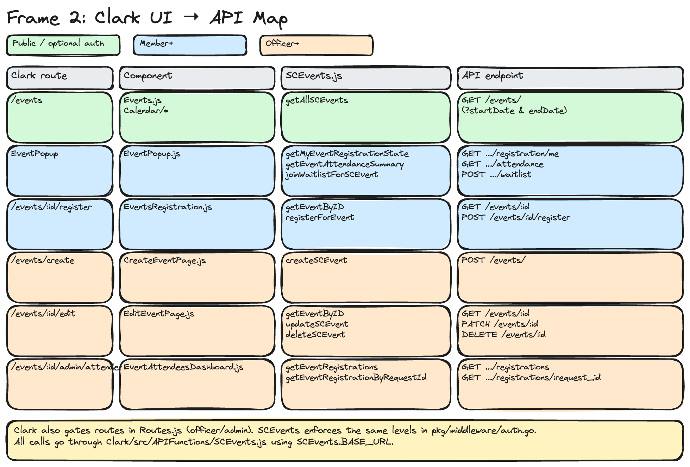
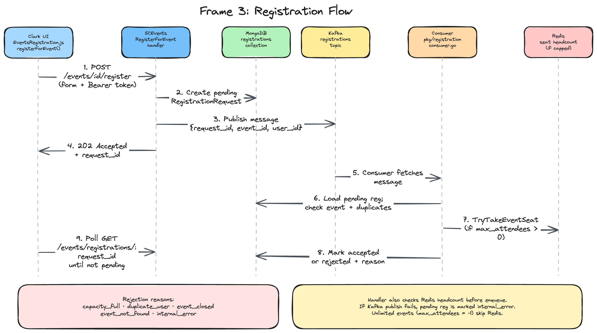

# SCEvents Onboarding

## 0. Start Here

### What this project does

This document is for SCE developers joining work on SCEvents. The goal is to give you a working mental model of the project — what it does, how it connects to Clark, where the important code lives — so you can explore the repo on your own and dive into specific areas as your tasks require.

SCEvents is SCE's event planning backend. It stores events, handles registrations and waitlists, and exposes a REST API. [Clark](https://github.com/SCE-Development/Clark) is the frontend members interact with; all event UI in Clark talks to SCEvents over HTTP. SCEvents is the main events system — there is no separate legacy events backend to worry about.

For deeper design history and decisions, see the [SCEvents Documentation](https://docs.google.com/document/d/1K1va_5XcoPiI-ZY19f7KfWbIexqOdnR_RKz9MlP3C2U) Google Doc. This onboarding guide does not replace that document; it focuses on getting you oriented in the codebase.

### 5-minute quick start

From the SCEvents repo root, start the stack:

```bash
docker compose -f docker-compose.dev.yml up --build -d
```

Have Clark running (see [Clark Getting Started](https://github.com/SCE-Development/Clark/wiki/Getting-Started); `sce run c` is the quickest path). Point Clark at SCEvents in `Clark/src/config/config.json`:

```json
{
  "SCEvents": {
    "BASE_URL": "http://localhost:8002"
  }
}
```

Confirm SCEvents is up: `http://localhost:8002/ping` should return JSON. Open Clark's Events page at `/events` and confirm events load without the "SCEvents might be down" error.

### Prerequisites

- **Docker** — SCEvents is developed with Docker only
- **Clark** — run locally on day one; testing across the full stack is much easier with both services up
- **Test accounts** — create **member**, **officer**, and **admin** accounts via the [Clark Getting Started wiki](https://github.com/SCE-Development/Clark/wiki/Getting-Started)
- **Go** — needed to run unit tests and builds locally (see Ship → CI)
- **golangci-lint** v2.11.4 — needed to run lint locally (see Ship → CI)


### Important links

| Resource | Location |
| -------- | -------- |
| Quick local setup | [README.md](README.md) |
| Design doc | [Google Doc](https://docs.google.com/document/d/1K1va_5XcoPiI-ZY19f7KfWbIexqOdnR_RKz9MlP3C2U) |
| Clark setup | [Clark Getting Started wiki](https://github.com/SCE-Development/Clark/wiki/Getting-Started) |
| Integration testing | [testing/README.md](testing/README.md) |
| Migration tool | [cmd/README.md](cmd/README.md) |

Diagrams are embedded in the sections below (`system_map.png`, `scevents.png`, `api_map.png`, `registration_flow.png`).

---


## 1. System Overview

### Architecture

SCEvents is a Go service built on [Gin](https://github.com/gin-gonic/gin). It runs alongside four supporting services in local development:

| Service | Role |
| ------- | ---- |
| **Go server** | HTTP API, background workers |
| **MongoDB** | Source of truth for events, registrations, waitlist entries |
| **Redis** | Fast cache for seat counts on capacity-limited events |
| **Kafka** | Async queue for processing registration requests |



*Full system map: Clark, nginx, auth, SCEvents server, MongoDB, Redis, and Kafka.*


*Simplified overview: Clark and the docker-compose backend stack.*

The [Excalidraw diagrams](https://excalidraw.com/#json=blzinrcwsw_ZrNasTCHi5,2kjWQhJKEaD1ROrF5Nan3A) are also kept up to date. Editable sources live in `docs/` (`scevents-frame1-system-map.excalidraw`, `scevents-frame2-clark-api-map.excalidraw`, `scevents-frame3-registration-flow.excalidraw`).

When the server starts (`cmd/server/main.go`), it connects to MongoDB and Redis, spins up a Kafka consumer for registrations, starts a background publisher that auto-publishes scheduled events, and optionally runs periodic schema migrations. The HTTP server listens on port `8002` by default.

### External systems / Clark

In production, Clark's nginx proxy is the only entry point users hit. Browser requests to `/api/scevents/...` are rewritten and forwarded to the SCEvents server. Clark's own API (`/api/...`) is handled separately. You can see this in Clark's `nginx.conf`:

```
location /api/scevents/ {
    ...
    rewrite ^/api/scevents/?(.*)$ /$1 break;
    proxy_pass http://scevents-server:8002;
}
```

Locally, Clark and SCEvents run as separate processes. Clark's frontend config points directly at the SCEvents port instead of going through nginx.

SCEvents does not call back into Clark for business logic. The one integration point is authentication: when a request includes a Bearer token, SCEvents verifies it by POSTing to Clark's `/api/Auth/verify` endpoint. Clark returns the user's `_id` and `accessLevel`, which SCEvents uses to enforce permissions. Registration form answers and event data are sent from Clark to SCEvents as JSON in request bodies — SCEvents stores and validates them on its own.

The API client layer in Clark lives in `Clark/src/APIFunctions/SCEvents.js`. Every Events page imports from there rather than calling fetch directly.

### System dependencies


| Dependency | Purpose                                                             |
| ---------- | ------------------------------------------------------------------- |
| MongoDB    | Events, registrations, waitlist entries                             |
| Redis      | Seat headcount for capacity-limited events (`event:<id>:headcount`) |
| Kafka      | Async registration processing (`registrations` topic)               |
| Clark API  | Token verification only (`/api/Auth/verify`)                        |


### Environments


| Environment | Clark `SCEvents.BASE_URL` | Notes                                                                           |
| ----------- | ------------------------- | ------------------------------------------------------------------------------- |
| Local       | `http://localhost:8002`   | Clark and SCEvents run as separate processes                                    |
| Deployed    | `/api/scevents`           | Routed through Clark's nginx proxy (see `Clark/src/config/config.example.json`) |


Staging and production are largely the same from a developer's perspective. The norm is to develop and verify locally, then deploy once changes look good on your machine.

---


## 2. Understand the Product

### Domain concepts

**Events** (`pkg/models/event.go`) have a lifecycle driven by `status`:

- `draft` — not visible to the general public
- `published` — open for registration (unless closed)
- `closed` — registration is no longer accepted

Events can be `public` or `private`. Private events require the viewer to meet `minimum_visible_role`. Events can have a scheduled `publish_date`; a background job in `cmd/server/publisher.go` auto-publishes them when the time arrives.

`max_attendees` controls capacity. A value of `-1` means unlimited (no Redis tracking). Any positive value enables capacity-limited registration with Redis headcount.

Events support custom `registration_form` questions (textbox, multiple choice, dropdown, checkbox). Answers are validated server-side before a registration is accepted.

**Registrations** are tracked as a `RegistrationRequest` (`pkg/models/registration.go`) with status `pending`, `accepted`, or `rejected`. Each request gets a unique `request_id` that the frontend polls until processing completes.

**Waitlist** — when an event has `waitlist_enabled` and is at capacity, users can join the waitlist via `POST /events/:id/waitlist`. Waitlist entries are stored in MongoDB (`pkg/db/waitlist.go`, `pkg/models/waitlist.go`).

Waitlists currently only support joining and checking whether a user is waitlisted. There is no automatic promotion when a seat opens, no leave-waitlist endpoint, and no Kafka processing for waitlist entries. Any promotion or cleanup workflow would need to be designed and implemented separately.

**Redis and seat counts** — Redis holds a headcount per capacity-limited event. This gives a fast way to check remaining seats without hitting MongoDB on every registration attempt. When an event is created or its capacity changes, the headcount is initialized in Redis. The Kafka consumer decrements it atomically when accepting a registration. Unlimited events (`max_attendees == -1`) never touch Redis for capacity.

### Glossary


| Term                   | Meaning                                                       |
| ---------------------- | ------------------------------------------------------------- |
| `request_id`           | Unique ID for a registration request; used for status polling |
| `headcount`            | Redis-tracked remaining seats for capacity-limited events     |
| `registration_form`    | Custom questions attached to an event                         |
| `publish_date`         | Scheduled time when a draft event auto-publishes              |
| `minimum_visible_role` | Role required to see a private event                          |


### User roles

SCEvents trusts Clark for identity. Every protected endpoint checks the `Authorization: Bearer <token>` header by calling `CLIENT_API_URL/api/Auth/verify`. The response includes `accessLevel`, which maps to SCE membership states (defined in `pkg/middleware/auth.go` and synced with Clark's `Enums.js`):


| accessLevel | State      | Typical use in SCEvents              |
| ----------- | ---------- | ------------------------------------ |
| 0           | Non-member | Can register for events              |
| 1           | Member     | Can register for events              |
| 2           | Officer    | Can create, edit, and delete events  |
| 3           | Admin      | Same as officer for event management |


Routes are grouped by minimum access level in `cmd/server/main.go`:

- **Public reads** (`GET /events`, `GET /events/:id`) use optional auth — anonymous users can view public events, but authenticated users get personalized metadata.
- **Authenticated** (non-member and above): registration, waitlist, and viewing own registration state. Attendance summaries, registration lists, registration details, and attendee lists also require the caller to be an admin of that event.
- **Officer and above**: creating, updating, and deleting events.

When testing locally, log into Clark with accounts at member, officer, and admin levels to confirm the permission boundaries behave as expected.

### Event admins

In addition to site roles, each event has an `admins` list (`pkg/models/event.go`). This is separate from Clark membership level.

- The event creator is always added to `admins` on create.
- **Update and delete** require officer-level route access *and* `CanEdit`: if the event has admins listed, only those users may modify it; if `admins` is empty, only site **admin** role may modify it.
- **Viewing registrations** (`GET .../registrations`, attendees dashboard) requires being an event admin (`loadEventAndAuthorizeAdmin`).
- **Event admins cannot register** for events they administer (`RegisterForEvent` rejects listed admins).

Clark also filters draft/private visibility client-side in `Events.js` (`canUserSeeEvent`) — event admins and officers can see drafts before the public can.

### Registration lifecycle

1. User submits registration form → `pending` record created in MongoDB
2. Kafka message published with `request_id`, `event_id`, `user_id`
3. Consumer processes message → `accepted` or `rejected` (with `decision_reason`)
4. Frontend polls `GET /events/registrations/:request_id` until status is no longer `pending`

Defined rejection reasons: `capacity_full`, `duplicate_user`, `event_closed`, `event_not_found`, `internal_error`, `invalid_payload`, and `already_processed`. The latter two are currently defined in the model but are not emitted by the consumer's active processing path.

If Kafka publish fails after the pending record is created, the handler marks the registration as rejected with `internal_error`.

---


## 3. Understand the Code

### Codebase map

```
SCEvents/
├── cmd/
│   ├── server/          # Main entry point, route setup, background workers
│   └── migrate/         # One-off MongoDB backfill tool for new default fields
├── pkg/
│   ├── config/          # Environment variable loading
│   ├── handlers/        # HTTP handlers (start here for API changes)
│   ├── middleware/      # Auth (Clark token verification)
│   ├── models/          # Event, Registration, Waitlist structs and validation
│   ├── db/              # MongoDB and Redis store implementations
│   ├── registration/    # Kafka producer and consumer
│   └── migration/       # Auto-migration logic for schema defaults
├── docker/              # Dockerfiles
├── docker-compose.dev.yml
└── testing/             # Integration and load tests
```


### UI map



*Clark routes, components, SCEvents.js functions, and API endpoints by permission level.*

All SCEvents-related UI lives under `Clark/src/Pages/Events/`. The API layer is `Clark/src/APIFunctions/SCEvents.js`.


| Clark route                   | Component                    | What it does                                          |
| ----------------------------- | ---------------------------- | ----------------------------------------------------- |
| `/events`                     | `Events.js`                  | Calendar view of events; fetches via `getAllSCEvents` |
| `/events/:id/register`        | `EventsRegistration.js`      | Registration form for a single event                  |
| `/events/create`              | `CreateEventPage.js`         | Officer/admin event creation                          |
| `/events/:id/edit`            | `EditEventPage.js`           | Officer/admin event editing and deletion              |
| `/events/:id/admin/attendees` | `EventAttendeesDashboard.js` | View registrations and attendance summary             |


The calendar UI is split across `Clark/src/Pages/Events/Calendar/` (`CalendarView.js`, `EventPopup.js`, etc.). `EventPopup.js` handles per-event actions like registering or joining the waitlist from the calendar.

Shared form logic for registration questions lives in `useEventQuestions.js` and `CreateEventFormQuestionBlock.js`. Utility helpers (date formatting, error messages) are in `eventUtils.js`.

Clark mirrors SCEvents JSON field names in component state (snake_case like `max_attendees`, `registration_form`). When you change a field on the backend, you will usually need to trace it through the matching Clark page and `SCEvents.js` API function.

Visibility filtering for which events appear on the calendar is handled client-side in `Events.js` (`canUserSeeEvent`). Draft events are only visible to event admins and officers/admins. Public and private events follow `visibility` and `minimum_visible_role` rules defined on the event model.

### API overview

All routes are under the `/events` prefix. The handler implementations are in `pkg/handlers/event.go`.

**Public (optional auth)**

- `GET /events/` — list events (supports `startDate` and `endDate` query params)
- `GET /events/:id` — get a single event
- `GET /events/registrations/:request_id` — poll registration status by request ID

**Authenticated (member+)**

- `POST /events/:id/register` — submit a registration (returns `request_id` for polling)
- `POST /events/:id/waitlist` — join the waitlist when an event is full
- `GET /events/:id/registration/me` — current user's registration state for an event
- `GET /events/:id/attendance` — attendance summary
- `GET /events/:id/registrations` — paginated list of registrations (for admins)
- `GET /events/:id/registrations/:request_id` — single registration detail
- `GET /events/:id/attendees` — attendee list

**Officer+**

- `POST /events/` — create event
- `PATCH /events/:id` — update event
- `DELETE /events/:id` — delete event and related data

The Clark API client in `SCEvents.js` wraps each of these endpoints. When debugging, compare the network tab in your browser against the handler in `event.go` to trace a request end to end.

The route-level `member+` check is not the complete authorization rule for event data. Registration lists, individual registration details, attendance summaries, and attendee lists additionally call event-admin authorization. Event editing and deletion require officer-level access plus the event's `CanEdit` rule.

### Registration API example

Submit a registration with a Clark Bearer token:

```bash
curl -X POST http://localhost:8002/events/<event_id>/register \
  -H "Authorization: Bearer <clark_token>" \
  -H "Content-Type: application/json" \
  -d '{
    "registrant": {
      "name": "Test Member",
      "email": "test@example.com",
      "user_id": "<user_id>"
    },
    "registration_form_answers": {}
  }'
```

The accepted request returns HTTP `202` with a `request_id`:

```json
{
  "message": "registration request received",
  "event_id": "<event_id>",
  "request_id": "<request_id>"
}
```

Poll until `status` is no longer `pending`. The current endpoint requires the registering user's ID as a query parameter:

```bash
curl "http://localhost:8002/events/registrations/<request_id>?user_id=<user_id>"
```

An accepted response has `"status": "accepted"`. A rejected response has `"status": "rejected"` and a `decision_reason`, such as `capacity_full`, `duplicate_user`, or `event_closed`.

### Database / schema


| Store   | Collections / keys     | Contents                                             |
| ------- | ---------------------- | ---------------------------------------------------- |
| MongoDB | `events`               | Event documents (`pkg/models/event.go`)              |
| MongoDB | `registrations`        | Registration requests (`pkg/models/registration.go`) |
| MongoDB | `waitlists`            | Waitlist entries (`pkg/models/waitlist.go`)          |
| Redis   | `event:<id>:headcount` | Remaining seats for capacity-limited events          |


If you add a new field to an event or registration model with a `default` struct tag, existing MongoDB documents won't have that field until a migration runs. The server can auto-migrate on an interval (`AUTO_MIGRATE_ENABLED`), or you can run `go run ./cmd/migrate events` manually — see `cmd/README.md`.

### Important design decisions

- **Async registration** — registrations are enqueued to Kafka and processed by a consumer, not handled synchronously in the HTTP handler
- **Clark auth only** — SCEvents verifies identity via Clark but does not call Clark for business logic
- **Redis for capacity** — seat counts are cached in Redis for fast, concurrency-safe capacity checks; unlimited events skip Redis entirely
- **Optional auth on reads** — public event endpoints allow anonymous access but enrich responses when a valid token is present

---


## 4. Follow the Data

### Registration flow



*Async registration: handler → MongoDB → Kafka → consumer → Redis → polling.*

Registration is asynchronous. Understanding this flow is central to working on SCEvents.

1. **User submits the form** in Clark (`EventsRegistration.js` calls `registerForEvent`).
2. **SCEvents handler** (`RegisterForEvent` in `pkg/handlers/event.go`) validates the payload, checks for duplicate registrations, verifies the event is open, does a quick capacity check against Redis, validates form answers, and creates a `pending` registration in MongoDB.
3. **Kafka message** is published (`pkg/registration/producer.go`) with the `request_id`, `event_id`, and `user_id`.
4. **Consumer processes the message** (`pkg/registration/consumer.go`):
  - Loads the pending registration from MongoDB
  - Verifies the event still exists and is not closed
  - Checks for duplicate accepted registrations
  - If the event has a capacity limit, atomically takes a seat in Redis (`TryTakeEventSeat`)
  - Marks the registration as `accepted`, or `rejected` with a reason
5. **Frontend polls** registration status via `GET /events/registrations/:request_id` until the status moves out of `pending`.


### Authentication flow

1. Clark frontend sends request to SCEvents with `Authorization: Bearer <token>`
2. SCEvents middleware calls `POST CLIENT_API_URL/api/Auth/verify` with the same token
3. Clark returns `{ _id, accessLevel }`
4. SCEvents sets `userID`, `userRole`, and `accessLevel` on the request context
5. Route-level middleware enforces minimum `accessLevel` for protected endpoints

Public read endpoints use `OptionalAuth` — invalid or missing tokens proceed anonymously rather than returning 401.

### Clark integration flow

1. Clark UI component calls a function in `Clark/src/APIFunctions/SCEvents.js`
2. Request goes to `SCEvents.BASE_URL` + endpoint path
  - Local: `http://localhost:8002/events/...`
  - Deployed: `/api/scevents/events/...` → nginx rewrites to SCEvents server
3. SCEvents handler processes request, reads/writes MongoDB and Redis as needed
4. JSON response returned to Clark UI


### Other important workflows

**Auto-publish** — `cmd/server/publisher.go` runs on a 30-second ticker and publishes draft events whose `publish_date` has passed.

**Waitlist** — when an event is at capacity and `waitlist_enabled`, users call `POST /events/:id/waitlist`. Entries are written directly to MongoDB (no Kafka).

Waitlist entries are not automatically promoted into registrations when capacity becomes available. There is currently no endpoint for leaving a waitlist; duplicate joins are rejected and a waitlist entry remains until the event is deleted or a future workflow removes it.

**Schema migration** — if `AUTO_MIGRATE_ENABLED` is true, the server periodically backfills missing default fields on existing documents. Manual backfills use `go run ./cmd/migrate events` or `go run ./cmd/migrate registrations`.

---


## 5. Develop

### Local setup

SCEvents is developed with Docker only. From the SCEvents repo root:

```bash
docker compose -f docker-compose.dev.yml up --build -d
```

This starts MongoDB (host port `8100`), Redis (`8101`), Kafka (`9092`), and the Go server with hot reload via Air (`8002`).

### Local ports

| Service | Host port | Notes |
| ------- | --------- | ----- |
| SCEvents API | `8002` | `GET /ping`, Clark `BASE_URL` target |
| MongoDB | `8100` | `mongosh mongodb://localhost:8100` |
| Redis | `8101` | `redis-cli -p 8101` |
| Kafka | `9092` | used internally; rarely touched directly |
| Clark frontend | `3000` | Events UI (`/events`) |
| Clark API | `8080` | auth verify (`CLIENT_API_URL`) |

You should also have Clark running on day one. Follow the [Clark Getting Started wiki](https://github.com/SCE-Development/Clark/wiki/Getting-Started) to clone, set up, and run Clark (`sce run c` is the quickest path). Create test accounts at different access levels using the wiki's account creation steps.

The server uses [Air](https://github.com/air-verse/air) for hot reload in Docker. Edit a `.go` file and the server restarts automatically.

### Configuration

Environment variables are set in `docker-compose.dev.yml`. The important ones for Clark integration:


| Variable               | Default                            | Purpose                             |
| ---------------------- | ---------------------------------- | ----------------------------------- |
| `CLIENT_URL`           | `http://localhost:3000`            | Clark frontend origin (CORS)        |
| `CLIENT_API_URL`       | `http://host.docker.internal:8080` | Clark backend for auth verification |
| `SERVER_PORT`          | `8002`                             | SCEvents HTTP port                  |
| `MONGO_URI`            | `mongodb://mongodb:27017`          | MongoDB connection                  |
| `REDIS_ADDR`           | `redis:6379`                       | Redis connection                    |
| `KAFKA_BROKER`         | `kafka:29092`                      | Kafka broker                        |
| `AUTO_MIGRATE_ENABLED` | `true`                             | Periodic schema backfill            |


Clark config (`Clark/src/config/config.json`):

```json
{
  "SCEvents": {
    "BASE_URL": "http://localhost:8002"
  }
}
```


### Common developer tasks

- Adding or changing an API endpoint → `pkg/handlers/event.go`, then register the route in `cmd/server/main.go`
- Changing event or registration data shape → `pkg/models/`, then `pkg/db/` store methods
- Changing capacity or seat logic → `pkg/db/redis.go` and `pkg/registration/consumer.go`
- Changing auth rules → `pkg/middleware/auth.go` and route groups in `main.go`
- Changing the Clark UI → `Clark/src/Pages/Events/` and `Clark/src/APIFunctions/SCEvents.js`
- Database backfills for new fields with defaults → `cmd/migrate/` (see `cmd/README.md`)


### Testing

SCEvents has three layers of tests:

**Unit tests** live alongside the code they test (`*_test.go` files in `pkg/`). CI runs `go test ./...` on every PR to `main` (see `.github/workflows/go-ci.yml`).

**Integration tests** spin up the full Docker stack including a mock Clark auth server (`testing/integration/mock_clark/`). The mock echoes the Bearer token as a user ID with admin access level. Run them with:

```bash
make integration
make integration TEST=create    # event creation flow
make integration TEST=register  # registration flow
```

See [testing/README.md](testing/README.md) for full details, teardown commands, and load testing with k6.

**Linting** runs via `.github/workflows/lint.yml` on PRs.

When you make a change, run the relevant unit tests locally. If your change touches registration or event creation flows, run the matching integration test before opening a PR.

---


## 6. Debug

### Troubleshooting

Check SCEvents logs first:

```bash
docker compose -f docker-compose.dev.yml logs -f server
```

| Symptom | Likely cause | What to check |
| ------- | ------------ | ------------- |
| Clark: "SCEvents might be down" | SCEvents not running or wrong `BASE_URL` | `curl http://localhost:8002/ping`; `Clark/src/config/config.json` → `SCEvents.BASE_URL` |
| Create/edit: "Is the SCEvents API running?" | Same as above | Docker stack up; port `8002` reachable |
| `401` on protected routes | Token verify failing | Clark API on `:8080`; `CLIENT_API_URL` in `docker-compose.dev.yml` (use `host.docker.internal:8080` when Clark runs on host) |
| CORS errors in browser | Frontend origin mismatch | `CLIENT_URL` matches where Clark runs (default `http://localhost:3000`) |
| Registration stuck `pending` | Kafka consumer not processing | `docker compose ... logs server` for consumer errors; Kafka container healthy |
| `403` editing an event | Not an event admin | User in event `admins` list, or site admin if event has no admins |
| `403` creating an event | Not officer/admin | Log in with officer or admin test account |
| Wrong seat count / capacity | Redis headcount out of sync | Restart after capacity changes; inspect `redis-cli -p 8101` key `event:<id>:headcount` |

### Local recovery checklist

Use these checks before changing data:

```bash
# Follow the API, Kafka consumer, publisher, and migration logs
docker compose -f docker-compose.dev.yml logs -f server

# Inspect a capacity key
redis-cli -p 8101 GET event:<event_id>:headcount

# Check MongoDB registration and waitlist records
mongosh mongodb://localhost:8100
use scevents
db.registrations.find({event_id: "<event_id>"}).sort({created_at: -1}).limit(10)
db.waitlists.find({event_id: "<event_id>"}).sort({created_at: 1})
```

If a registration stays `pending`, check the server logs for Kafka connection or consumer errors first. The consumer only commits a Kafka message after processing succeeds, so processing errors can be retried after the underlying problem is fixed. A pending record created before a Kafka publish failure is normally marked `rejected` with `internal_error` by the handler.

Redis headcount is a derived value and there is currently no standalone reconciliation command. If a local headcount is missing or incorrect, inspect the event and registration data before changing it; re-saving the event capacity through the normal event update path re-synchronizes its Redis headcount. Do not manually delete the key unless you are prepared to restore it before testing registrations.

For schema changes that add fields with `default` tags, run the relevant migration from the repo root after confirming `MONGO_URI` points to the intended database:

```bash
MONGO_URI=mongodb://localhost:8100 go run ./cmd/migrate events
MONGO_URI=mongodb://localhost:8100 go run ./cmd/migrate registrations
```

### Common errors

Registration decision reasons defined by the model:


| Reason            | Cause                                                     |
| ----------------- | --------------------------------------------------------- |
| `capacity_full`   | Event at max capacity when consumer processed the request |
| `duplicate_user`  | User already has an accepted registration                 |
| `event_closed`    | Event status is `closed`                                  |
| `event_not_found` | Event was deleted before consumer processed               |
| `internal_error`  | Kafka publish failed or other server error                |
| `invalid_payload` | Reserved for invalid registration data                    |
| `already_processed` | Reserved for a registration that is no longer pending  |


Clark UI shows "SCEvents might be down" when `getAllSCEvents` fails — usually means SCEvents isn't running or `BASE_URL` is misconfigured.

Create/edit pages show a network hint: "Is the SCEvents API running (e.g. Docker on port 8002)?" when the API is unreachable.

---


## 7. Ship

### Branching

Branch names follow the pattern `<your-name>/<short-description>`, for example `ernest_ma/adding_onboarding_doc`.

### PRs

Open a PR against `main` when your changes are ready.

### Two-repo workflow

SCEvents and Clark are **separate repositories**. Most feature work touches both:

| Change type | Repos |
| ----------- | ----- |
| New/changed API field or endpoint | SCEvents + Clark (`SCEvents.js` + Events pages) |
| UI-only (labels, layout) | Clark only |
| Backend-only (capacity, consumer, auth) | SCEvents only |

Typical flow:

1. Implement and test the API change in SCEvents locally.
2. Update Clark's `SCEvents.js` and the matching page under `Clark/src/Pages/Events/`.
3. Open a PR in each repo (same branch naming: `<name>/<feature>`).
4. Verify end-to-end with both services running before merge.

If the API ships before Clark, new fields are simply unused until the frontend PR merges. Breaking API changes should land with the matching Clark update.

### CI

CI must pass before merge. Three workflows run on PRs to `main` — reproduce them locally from the SCEvents repo root:

**Go build and unit tests** (`.github/workflows/go-ci.yml`):

```bash
go mod tidy
go mod vendor
git diff --exit-code -- go.mod go.sum
go build ./...
go test ./...
```

The `git diff` step fails if `go mod tidy` changed `go.mod` or `go.sum`; commit those files if so.

**Lint** (`.github/workflows/lint.yml` — requires [golangci-lint](https://golangci-lint.run/) v2.11.4):

```bash
golangci-lint run --timeout=5m
```

**Integration tests** (`.github/workflows/integration.yml` — requires Docker):

```bash
make integration
make teardown-integration
```


### Deployment

Develop and verify locally, then deploy once changes look good on your machine. In deployed environments, Clark's nginx proxies `/api/scevents` to the SCEvents server.

---


## 8. Ownership & Resources

### Reference links

| Resource | Location |
| -------- | -------- |
| Onboarding guide | [ONBOARDING.md](ONBOARDING.md) |
| Quick local setup | [README.md](README.md) |
| System map | `system_map.png` |
| High-level overview | `scevents.png` |
| Clark UI → API map | `api_map.png` |
| Registration flow | `registration_flow.png` |
| Excalidraw sources | `docs/*.excalidraw` |
| Clark API client | `Clark/src/APIFunctions/SCEvents.js` |
| Clark Events pages | `Clark/src/Pages/Events/` |
| Integration testing | [testing/README.md](testing/README.md) |
| Migration tool | [cmd/README.md](cmd/README.md) |


### External documentation


| Resource    | Location                                                                                      |
| ----------- | --------------------------------------------------------------------------------------------- |
| Design doc  | [Google Doc](https://docs.google.com/document/d/1K1va_5XcoPiI-ZY19f7KfWbIexqOdnR_RKz9MlP3C2U) |
| Clark setup | [Clark Getting Started wiki](https://github.com/SCE-Development/Clark/wiki/Getting-Started)   |
