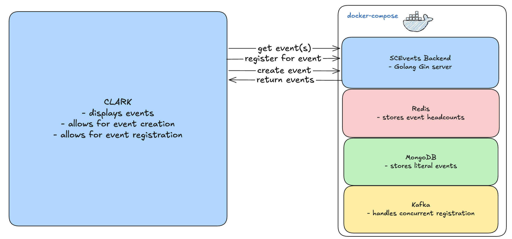

# SCEvents
Welcome to SCE's event planner platform!

## Setup (requires Docker)

### 1. Clone the repository
```
git clone https://github.com/SCE-Development/SCEvents.git
cd SCEvents
```
### 2. Start the services
```
docker-compose up --build -d
```

NOTE: To test SCEvents together with the frontend, you'll need to run Clark separately [following the instructions here](https://github.com/SCE-Development/Clark/wiki/Getting-Started)

## Tech Stack
[Excalidraw](https://excalidraw.com/#json=blzinrcwsw_ZrNasTCHi5,2kjWQhJKEaD1ROrF5Nan3A)


